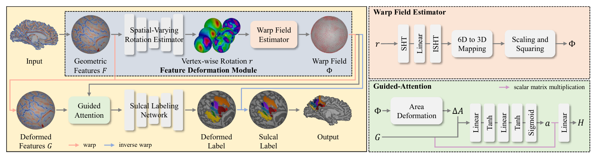
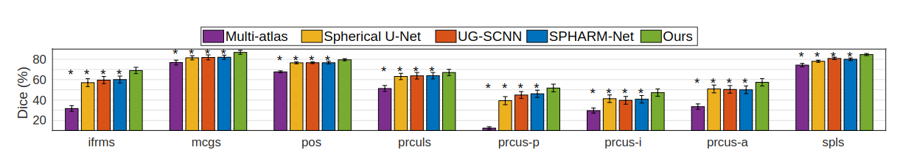
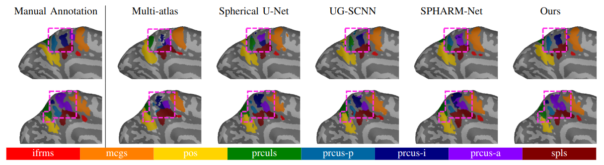

# Leveraging Input-Level Feature Deformation with Guided-Attention for Sulcal Labeling

## Introduction
This repo is the official [PyTorch](https://pytorch.org/) implementation of **Leveraging Input-Level Feature Deformation with Guided-Attention for Sulcal Labeling**.
Below is the overall pipeline of our method. 

## Getting Started

Clone the following repos:
```bash
git clone https://github.com/Shape-Lab/SPHARM-Net.git
git clone https://github.com/Shape-Lab/DSPHARM-Net.git
```

Install the requirements under `conda`:
```bash
# create conda env.
conda create -n dspharm-net python=3.8
conda activate dspharm-net

conda install pytorch==1.11.0 cudatoolkit=11.3 -c pytorch

# install dependencies.
cd SPHARM-Net && pip install .
cd ../DSPHARM-Net && pip install .
```
## Directory

### Root
```
${ROOT}
├── dataset
├── dspharmnet
├── logs
├── model_files
├── output
├── scripts
└── sphere
```
- `dataset` contains input geometric features and labels.
- `dspharmnet` contains the implementation of the proposed method.
- `logs` contains training information (configurations, subject IDs, and intermediate performance). It will be created automatically during training.
- `model_files` contains meta information required for training (e.g., `vfids.npy`).
- `output` contains test results. It will be created automatically at inference.
- `scripts` contains the example scripts for training and inference.
- `sphere` contains icosahedral spheres.

The icosahedral spheres for `sphere` can be found at [here](https://shape.postech.ac.kr/nextcloud/s/DSPHARM_NET). It is important to use these provided spheres because the associated metadata such as vfids.npy was generated based on them.

### Data
```
./dataset
├── features
│   ├── subj_1.lh.aug0.curv.dat
│   ├── subj_1.lh.aug0.inflated.H.dat
│   ├── subj_1.lh.aug0.sulc.dat
.   .
.   .
│   ├── subj_N.lh.aug0.curv.dat
│   ├── subj_N.lh.aug0.inflated.H.dat
│   └── subj_N.lh.aug0.sulc.dat
├── labels
│   ├── subj_1.lh.aug0.label.dat
.   .
.   .
.   └── subj_N.lh.aug0.label.dat
```
> Please follow the instruction at [SPHARM-Net](https://github.com/Shape-Lab/SPHARM-Net) for the data preparation. Rigid alignment to a template should be conducted prior to the data preparation.


## Training
Run the following script:
```
python ./scripts/train.py \
    --data-dir ${data_dir} \
    --aug ${aug} \
    --hemi ${hemi} \
    --sphere ${sphere} \
    --epochs ${epochs} \
    --learning-rate ${lr} \
    --loss ${loss} \
    --wsi ${wsi} \
    --wsl ${wsl} \
    -L ${L} \
    -D-L ${L} \
    -D-DL ${DL} \
    -C ${C} \
    -D-C ${D_C} \
    --gpu ${gpu} \
    --fold ${fold} \
    --log-dir ${log_dir}
```
**Arguments**
- `--data_dir`: input data directory (default: `./dataset`)
- `--aug`: the level of data augmentation (default: `0`)
- `--in-ch`: list of geometry (default: `["curv", "sulc", "inflated.H"]`)
- `--hemi`: hemisphere (`lh` or `rh`)
- `--sphere`: icosphere directory (default: `./sphere/ico6.vtk`)
- `--epochs`: epochs (default: `40`)
- `--learning-rate`: learning rate for training (default: `1e-2`)
- `--loss`: similarity loss function for sulcal labeling (default: `ce`)
- `--wsl`: weighting factor for sulcal labeling (default: `1`)
- `--wsi`: weighting factor for feature deformation (default: `10`)
- `-L`: entry spherical harmonic bandwidth for sulcal labelinnetwork (default: `120`)
- `-D-L`: entry spherical harmonic bandwidth for feature deformation module (default: `120`)
- `-D-DL`: spherical harmonic bandwidth for velocity field decomposition (default: `20`)
- `-C`: the channel size of sulcal labeling network (default: `128`)
- `-D-C`: the channel size of feature deformation module (default: `64`)
- `--gpu`: your gpu id (default: `0`)
- `--n-splits`: k-fold cross-validation (default: `5`)
- `--fold`: fold # for k-fold cross validation (default: `1`)
- `--log-dir`: directory to write training information (default: `./logs`)

If successful, you will see
```
Loading model...
100%|████████████████████████████████████████████████████████████| 42/42 [00:22<00:00,  1.88it/s]
Saving checkpoint...
```
> The GPU memory consumption may vary depending on CUDA kernels.

## Inference
Run the following script:
```
python ./scripts/inference.py \
    --subj-dir ${freesurfer_data_root}/${subj}/ \
    --hemi ${hemi} \
    --native-sphere ${native_sphere} \
    --native-sphere-dir ${native_sphere_dir} \
    --ckpt ./${ckpt_dir}/best_model_fold${fold}.pth \
    --out-dir output/${out_dir}
```
**Arguments**
- `--subj-dir`: FreeSurfer subject directory
- `--hemi`: hemisphere (`lh` or `rh`)
- `--native-sphere`: native sphere file (default: `sphere`)
- `--native-sphere-dir`: directory to native sphere (default: `surf`)
- `--out-dir`: output directory to save the results (default: `./output`)
- `--ckpt`: checkpoint file

## Experiment
**Subjects**

In our study, we validated our method on the following HCP subjects:
```
100206  100610  101309  102008  102816  103515  104416  105115  105923  106521  107321  108121
108525  109325  110411  114924  144125  151829  180937  268749  517239  566454  644044  867468
100307  101006  101410  102311  103111  103818  104820  105216  106016  107018  107422  108222
108828  109830  110613  128127  146937  164939  185947  365343  522434  585256  679770  910241
100408  101107  101915  102513  103414  104012  105014  105620  106319  107220  107725  108323
109123  110007  112920  133928  151425  176744  214019  380036  531536  622236  687163  959574
```
In addition, we used `$FREESURFER_HOME/average/?h.curvature.buckner40.filled.desikan_killiany.2010-03-25.gcs` as a target template for rigid alignment.

**Results**

Here are some qualitative and quantitative results.
<p align="center">

</p>

<p align="center">

</p>

> The pretrained checkpoints in this experiment can be found at [here](https://shape.postech.ac.kr/nextcloud/s/DSPHARM_NET). Note that rigid alignment is required for your input data to utilize these pretrained checkpoints.

## Citation
We work hard to share our code for better reproducible research. Please cite the following paper if you use (part of) our code for your research, including data preparation, neural networks, inference, utilities, etc.:
```
@article{Lee2024:DSPHARMNet,
  author    = {Lee, Seungeun, Lee, Seunghwan, Willbrand, Ethan H., Parker, Benjamin J., Bunge, Silvia A.,  Weiner, Kevin S., and Lyu, Ilwoo},
  title     = {Leveraging Input-Level Feature Deformation with Guided-Attention for Sulcal Labeling},
}
```
